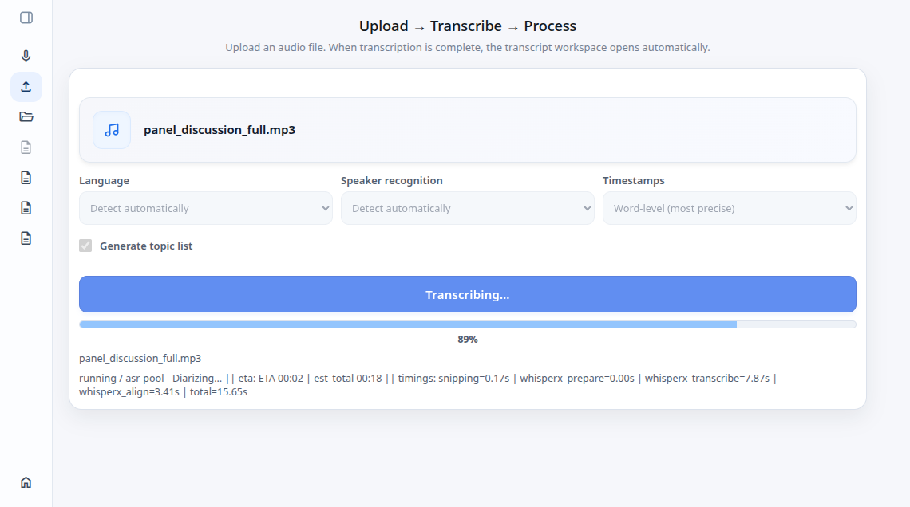

# Omniscripta UI

`omniscripta-ui` is the frontend source for the Omniscripta transcription
workspace.

It contains the browser app for live recording, uploaded-audio transcription,
transcript editing, document review, topic navigation, and export workflows.
The app is built as a lightweight JavaScript/CSS frontend and deploys its build
artifacts into the `static/` directory of the Omniscripta backend repo.

## Index

- [What It Does](#what-it-does)
- [Repository Role](#repository-role)
- [Related Repositories](#related-repositories)
- [Code Map](#code-map)
- [Runtime Model](#runtime-model)
- [Backend Contract](#backend-contract)
- [Development](#development)
- [Build And Deploy](#build-and-deploy)
- [Screenshots](#screenshots)

## What It Does

- renders the Omniscripta landing page and app shell
- provides the live recording UI and WebSocket client behavior
- provides the upload workflow for audio transcription jobs
- provides the transcript editor with audio-aligned segment editing
- supports document-style transcript review
- displays LLM-generated topic lists when available
- stores local editor project metadata in the browser
- exports edited transcript artifacts through the backend API
- uses `@spa-foundation/core` for routing, shell state, dialogs, and persistence
- builds JS and CSS bundles with `esbuild`

## Repository Role

This repo is the editable frontend source for Omniscripta.

It is not the FastAPI backend and it is not the ASR or LLM runtime. Those live
in separate repositories. This UI talks to the Omniscripta backend API and is
deployed as static HTML, CSS, JavaScript, screenshots, and demo fixtures.

The deployed frontend artifacts are copied into the backend repository's
`static/` directory. In development, the backend repo can serve those artifacts
through its dev frontend proxy.

## Related Repositories

Omniscripta is split across focused repositories:

| Repository | Role |
| --- | --- |
| [`Bobcat/omniscripta`](https://github.com/Bobcat/omniscripta) | FastAPI portal backend, upload coordination, live session API, ops endpoints, and static deployment target. |
| [`Bobcat/spa-foundation`](https://github.com/Bobcat/spa-foundation) | Lightweight SPA primitives used by this frontend. |
| [`Bobcat/asr-pool`](https://github.com/Bobcat/asr-pool) | ASR pool used by the backend for WhisperX transcription work. |
| [`Bobcat/asr-pool-api`](https://github.com/Bobcat/asr-pool-api) | Python client used by backend services to talk to `asr-pool`. |
| [`Bobcat/asr-worker`](https://github.com/Bobcat/asr-worker) | File-backed upload worker that processes transcription jobs. |
| [`Bobcat/realtime-asr-engine`](https://github.com/Bobcat/realtime-asr-engine) | Live ASR timeline and transcript-state engine used by the backend. |
| [`Bobcat/llm-pool`](https://github.com/Bobcat/llm-pool) | LLM inference pool used for topic generation and other local LLM tasks. |

## Code Map

If you are new to the repo, these are the fastest entrypoints:

| Path | Role |
| --- | --- |
| `index.html` | Public landing page with feature sections and demo links. |
| `app/index.html` | Main application shell. |
| `js/app.js` | App composition, routing, sidebar state, dialogs, and workflow mounting. |
| `js/api.js` | Backend API boundary used by the UI. |
| `js/live/` | Live recording workflow, live session service, audio capture, and benchmark view. |
| `js/upload/UploadView.js` | Uploaded-audio transcription workflow. |
| `js/upload/editor/` | Transcript editor, filtering, find/replace, playback, shortcuts, and segment helpers. |
| `js/upload/projects/` | Browser-side project metadata management. |
| `js/upload/files/` | Local file handle helpers for opening local transcript projects. |
| `js/settings/` | Settings view. |
| `css/` | App, landing page, layout, upload, editor, live, and token styles. |
| `landing-screenshots/` | Screenshots used by the landing page and README. |
| `dev-fixtures/` | Small demo audio/SRT fixtures used by the sample editor flows. |
| `deploy/` | Deployment scripts that build and copy frontend assets into a backend static target. |
| `docs/frontend-structure.md` | Notes on the intended frontend structure conventions. |

## Runtime Model

The UI is a browser application served as static files.

At runtime:

1. The browser loads the app shell from `app/index.html`.
2. `js/app.js` creates the shell, registers workflow views, and initializes the router.
3. Workflow views call the backend through `js/api.js` and workflow-specific services.
4. Live recording opens a backend WebSocket and streams PCM16 audio frames.
5. Upload transcription creates backend jobs and polls projected job status.
6. The transcript editor keeps audio playback, segment editing, local project metadata, and export actions in sync.

The frontend owns browser interaction and workspace state. The backend owns ASR,
LLM, upload queueing, live session state, artifacts, and persistence outside the
browser.

## Backend Contract

The app expects the Omniscripta backend to expose the portal API under `/api`.

Important API areas:

| Area | Used For |
| --- | --- |
| `/api/demo/live/sessions` | Create and read live recording sessions. |
| `/api/demo/live/sessions/{session_id}/ws` | Live recording WebSocket. |
| `/api/demo/live/sessions/{session_id}/result` | Final live result envelope and artifact links. |
| `/api/demo/jobs` | Uploaded-audio transcription job creation and status reads. |
| `/api/demo/jobs/{job_id}/transcript.srt` | Transcript artifact retrieval. |
| `/api/demo/exports` | Temporary export artifact creation and download. |
| `/api/ui/settings` | UI settings loaded at runtime. |

The frontend can also open local SRT/audio fixtures in the browser for demo and
editor workflows.

## Development

Install dependencies:

```bash
npm install
```

Run the frontend build check:

```bash
npm test
```

This project currently uses a local file dependency for `@spa-foundation/core`.
In a multi-repo workspace, keep `Bobcat/spa-foundation` checked out locally and
adjust the file dependency path if your checkout layout differs.

During normal Omniscripta development, the backend dev frontend proxy serves the
deployed static files and proxies `/api` requests to the dev backend.

## Build And Deploy

The build uses `esbuild` directly:

```bash
npm run build:js
npm run build:css
```

The deployment scripts build the JS/CSS bundles, copy HTML/CSS/static assets,
copy demo fixtures and landing screenshots, and add cache-busting query
parameters to the deployed HTML.

```bash
./deploy/deploy-dev.sh
./deploy/deploy.sh
```

Those scripts contain environment-specific defaults for local checkout paths and
static deployment targets. Adjust them for your own deployment layout.

## Screenshots





